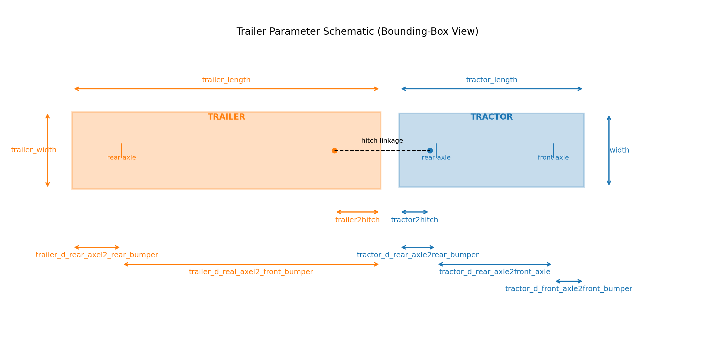
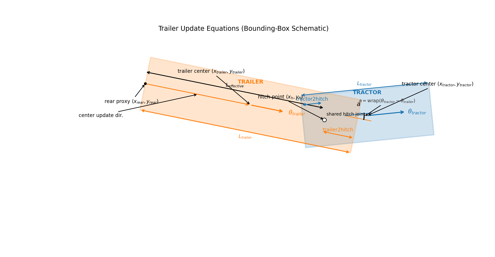

# Trailer Implementation

## 1) JSON Scenario Format

In scenario `metadata`:
- `has_ego_trailer` (`bool`): enables tractor+trailer coupling.
- `ego_trailer_track_index` (`int`): object index of ego trailer.
- `sdc_track_index` (`int`): ego tractor index.
- `non_kinematic_vehicle_params` (`dict[str,float]`): geometry package (13 floats, order fixed below).

### Binary Format Version

Per object:
- `source_track_id`: persisted as stable hash in the binary extension.
- Trailer identity is inferred by index equality: `obj_idx == ego_trailer_track_index`.

Binary extension written by `drive.py` and required by loader:
- `magic = 0x54524C52` (`"TRLR"`), `version = 2` ("magic" signature to confirm “this block is trailer data" + schema version)
- `has_ego_trailer`, `ego_trailer_track_index`
- per-object tuple: `(source_track_id_hash, is_trailer, parent_track_index)`
- `non_kinematic_vehicle_params` count must be `13`

## 2) Trailer Geometry + Parameters

Packed parameter order (`non_kinematic_vehicle_params`):
1. `tractor_length`
2. `trailer_length`
3. `width`
4. `trailer_width`
5. `vehicle_height`
6. `trailer_height`
7. `tractor2hitch`
8. `trailer2hitch`
9. `tractor_d_rear_axle2rear_bumper`
10. `tractor_d_rear_axle2front_axle`
11. `tractor_d_front_axle2front_bumper`
12. `trailer_d_rear_axel2_rear_bumper`
13. `trailer_d_real_axel2_front_bumper`

Note that depending on the vehicle parameters the distance between the tractor and trailer hitch points can vary (it can be 0, i.e. hitch points overlap).

Currently used directly by dynamics/render linkage:
- `tractor2hitch` = `non_kinematic_vehicle_params[6]`
- `trailer2hitch` = `non_kinematic_vehicle_params[7]`
- `effective_length = max(0.5, trailer.length - trailer2hitch)`

Quick parameter schematic (bounding-box view):

## 3) Trailer Update Equations

Trailer is dependent on SDC tractor (never independently controlled).

Given tractor heading `theta_tractor`, trailer heading `theta_trailer`, signed tractor speed `v`, dt `dt`, and articulation `a = wrap(theta_tractor - theta_trailer)`:

Notation: `_tractor` = tractor center, `_trailer` = trailer center, `_rear` = trailer rear proxy.

Here, `L_effective` denotes the effective distance (`L_effective = max(0.5, trailer.length - trailer2hitch)`).

- `theta_trailer <- wrap(theta_trailer + (v / L_effective) * sin(a) * dt)`
- Tractor hitch:
  - `x_h = x_tractor + (-0.5*L_tractor + tractor2hitch) * cos(theta_tractor)`
  - `y_h = y_tractor + (-0.5*L_tractor + tractor2hitch) * sin(theta_tractor)`
- Trailer rear axle proxy:
  - `x_rear = x_h - L_effective * cos(theta_trailer)`
  - `y_rear = y_h - L_effective * sin(theta_trailer)`
- Trailer center:
  - `x_trailer = x_rear + 0.5*L_trailer*cos(theta_trailer)`
  - `y_trailer = y_rear + 0.5*L_trailer*sin(theta_trailer)`
- Velocity update:
  - `vx_trailer = (x_trailer - x_trailer_prev)/max(dt,1e-4)`
  - `vy_trailer = (y_trailer - y_trailer_prev)/max(dt,1e-4)`

## 4) Collision / Offroad Logic

- Vehicle collisions use oriented box SAT (`check_aabb_collision`) for ego tractor and, when valid pair exists, also ego trailer.
- Ego-tractor vs ego-trailer self-pair is explicitly skipped.
- Offroad checks test road-edge segment intersection against 4 tractor edges and 4 trailer edges.
- A single collision state is emitted per controlled agent (`NO_COLLISION`, `VEHICLE_COLLISION`, `OFFROAD`).
- For debugging/render, combo flags are kept:
  - `combo_collision_any`
  - `combo_collision_tractor_body`
  - `combo_collision_trailer_body`

## 5) Raylib Visualization

- Scene render includes trailer body as a normal entity.
- `draw_ego_trailer_linkage` draws hitch-to-hitch orange link + spheres using same `tractor2hitch/trailer2hitch` geometry as dynamics update.
- Collision highlighting for ego combo uses tractor combo flags so tractor/trailer bodies can be visualized consistently.
- `visualize --ground-truth` replays stored trajectories for all dynamic entities; `visualize` without GT runs policy + simulator step.

## 6) When Trailer State Is Updated

Policy stepping (`c_step`):
- Active policy agent uses `move_dynamics`.
- If active agent is SDC and trailer pair is valid: `update_ego_trailer_pose` runs immediately after SDC dynamics each step.
- On SDC respawn (`respawn_agent`), trailer pose is recomputed once:
  - if `force_zero_trailer_articulation_at_init == 1`: `force_zero_trailer_articulation_pose_from_params` is used (resets articulation to zero),
  - otherwise: `update_ego_trailer_pose` is used (keeps articulated follow behavior).

Replay helpers (`move_expert`):
- `move_expert` sets trajectory state from logs, then if `agent_idx == sdc_track_index`, also runs `update_ego_trailer_pose` (keeps articulated consistency during expert replay flows).

Ground-truth visualization mode (`visualize --ground-truth`):
- Uses `move_expert_trajectory_only` for all dynamic entities each frame.
- Trailer follows logged GT trajectory directly in this mode (no coupling update call in that loop).

Control mode implications:
- `control_sdc_only`: policy controls only SDC; trailer is spawned but never policy-controlled; trailer motion comes from SDC coupling update (see equations above).
- `control_vehicles` / `control_agents` / `control_wosac`: trailer is still excluded from direct policy control; it is created for interaction checks and updated through SDC-dependent coupling when SDC is stepped.

Observation note:
- Policy observations are tractor-centric: ego trailer is excluded from the partner list, and collision is a single aggregated flag (`obs[5]`).
- Trailer state is incorporated via explicit query APIs, not the policy tensor:
  - `env.get_sdc_trailer_state()` (direct trailer pose/size per env)
  - `env.get_global_agent_state(include_sdc_trailer=True)` (active agents + trailer payload)
- Use these APIs for trailer-aware logging/evaluation/visualization.

## 7) Runtime Truck Override (`--sdc-runtime-truck-override`)

This mode lets you run a car-only scene as a tractor+trailer setup at runtime, without editing the scenario file.

What it does:
- Enables runtime non-kinematic parameter override from a reference trailer `.bin`. (Defining geometry parameters of the trailer)
- Forces zero articulation at init (`theta_trailer = theta_tractor`), then trailer motion is updated by articulated coupling in simulator steps.
- If scene metadata has no ego trailer, a synthetic trailer entity is injected at runtime and coupled to SDC.

Respawn / reset implications (override mode):
- Episode reset (`c_reset`) always calls `set_start_position`; with override enabled, trailer starts aligned with tractor (zero articulation).
- Mid-episode respawn (typically with `goal_behavior=respawn`) routes through `respawn_agent` and re-applies zero articulation when `force_zero_trailer_articulation_at_init` is active.
- In scenes with frequent respawns, articulation can repeatedly snap to zero at respawn boundaries by design.
- After runtime override applies trailer geometry and zero-articulation init pose, the env checks whether the SDC trailer is invalid at the initial state (collision or off-road).
- If the initial trailer state is invalid, that sampled map/env instance is rejected during vectorized setup; on reset, vector envs are resampled and recreated.

Reference parameter source:
- CLI visualizer:
  - `--sdc-runtime-truck-override`
  - Optional: `--sdc-runtime-truck-ref-bin <path/to/reference.bin>`
- Python env config:
  - `sdc_runtime_truck_override=True`
  - Optional: `sdc_runtime_truck_ref_bin=\"...\"`
- If no ref path is provided, default is:
  - `tests/artifacts/drive/traversing_traffic_light_intersection__97be27351e915863__97be27351e915863.bin`

## 8) Evaluation Coverage and Agent Marking 

- `mark_as_expert` and `tracks_to_predict` have different roles:
  - `mark_as_expert`: control/replay role (expert/static vs policy-controlled).
  - `tracks_to_predict`: evaluation role (which exported active tracks get valid eval IDs, `id >= 0`).
- WOSAC-style scoring is applied to the intersection:
  - `active_agent_indices` (actually active/controlled in the run),
  - and `tracks_to_predict` (eval-enabled tracks).

With the current JSON marking strategy (from my scenarioMax conversion: `tracks_to_predict` is built from controllable non-expert tracks and excludes trailer source IDs.)

Given the specific configurations for what vehicles to control:
- `control_sdc_only`:
  - only SDC is active,
  - SDC is scored only if SDC is present in `tracks_to_predict`,
  - trailer is never directly scored (but can affect SDC outcomes indirectly via coupled collision/offroad logic).
- `control_vehicles` / `control_agents` with non-expert selection:
  - many policy-controlled agents can be scored,
  - effective scored set is still `active ∩ tracks_to_predict`,
  - trailer remains excluded from direct scoring as a policy track.
